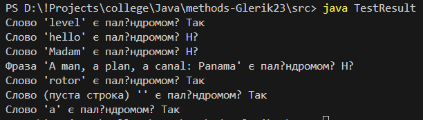

# Практична робота "Створення і використання статичних методів"

Цей репозиторій містить рішення практичної роботи зі створення та використання статичних методів у Java. Завдання полягало у модифікації стартового коду для перевірки, чи є задане слово паліндромом. Це завдання було обрано як найпростіше з запропонованого списку.

## Завдання

Реалізувати функціонал перевірки, чи є вхідний рядок паліндромом, використовуючи статичний метод класу `Exercise`, та продемонструвати його роботу у класі `TestResult`. Метод `Calculate` має повернути булевське значення (`true` або `false`).

## Опис завдання: Перевірка на паліндром

**Паліндром** - це слово, фраза, число або інша послідовність символів, яка читається так само в обох напрямках (зліва направо та справа наліво). Приклади слів-паліндромів: "level", "rotor", "madam".

В рамках цієї роботи реалізовано просту перевірку паліндрома, яка **чутлива до регістру** символів та враховує пробіли/інші символи, якщо вони присутні у вхідному рядку.

## Реалізація

В рамках цієї роботи було модифіковано два класи:

1.  **`Exercise.java`:**
    * Містить статичний метод `public static boolean Calculate(String inputString)`, який приймає рядок і повертає `true`, якщо рядок є паліндромом, та `false` в іншому випадку.
    * Реалізація полягає у створенні реверсованої версії вхідного рядка (за допомогою `StringBuilder.reverse()`) та подальшому порівнянні оригінального рядка з його реверсованою версією за допомогою методу `equals()`.
    * Додані Javadoc коментарі для опису функціоналу.
    * Використані базові операції над рядками, що є оптимальним рішенням з точки зору пам'яті та продуктивності для даного простого завдання.

2.  **`TestResult.java`:**
    * Містить стандартний метод `public static void main(String[] args)`, який є точкою входу в програму.
    * В цьому методі задаються тестові рядки для перевірки.
    * Викликається статичний метод `Exercise.Calculate()` для кожного тестового рядка.
    * Результат (`true` або `false`) виводиться на консоль з відповідним пояснювальним текстом для кожного тестового випадку.

## Приклад використання

**Вхідні дані (приклади у класі `TestResult.java`):**

* `"level"`
* `"hello"`
* `"Madam"` (чутливість до регістру)
* `"rotor"`
* `""` (пуста строка)
* `"a"` (один символ)

**Очікуваний вихід (на консоль):**

